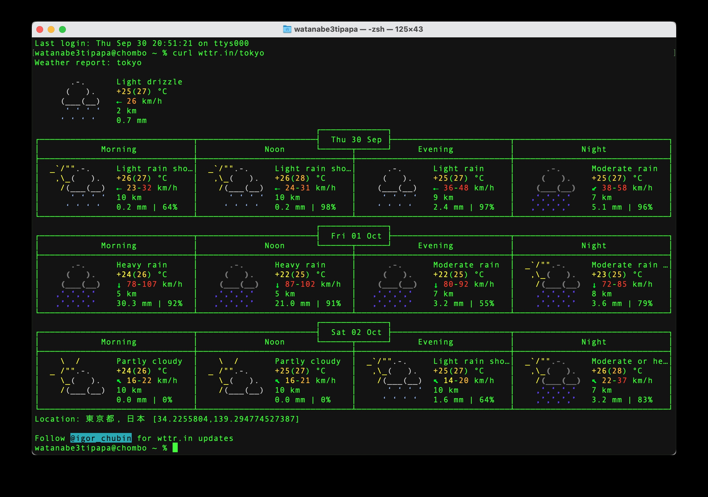

# How to execute from Terminal 001

---

---

- ターミナルから実行（天気予報）
    
    天気予報
    
    ```bash
    curl wttr.in/tokyo
    ```
    
    >>> 結果
    
    
    

---

cURL（see URL）の入手先

[curl](https://curl.se)